# Macro Data Pipeline

An automated, multi-source ELT pipeline designed to extract, normalize, and store macroeconomic indicators from major statistical agencies. The system prioritizes data fidelity by preserving raw vintage data, enabling accurate point-in-time historical analysis.

## 🚀 Key Features

- Hybrid Ingestion Engine: Handles both REST API (JSON) and file-based (CSV/XLSX) sources with specialized parsing logic.
- Vintage Data Preservation: Immutable raw storage in PostgreSQL JSONB to support "as-published" historical reconstruction.
- High-Concurrency Fetching: Built on asyncio and aiohttp for efficient parallel data retrieval.
- Strict Data Validation: Utilizes Pydantic strict models and Pyright for robust static typing and schema enforcement.
- Advanced File Parsing: Implements Polars + Calamine with boundary detection for inconsistent Excel structures (e.g., ONS releases).

## Current Scope

| | |
|---|---|
| Countries | 2 (US, UK) |
| **Indicators** | 45 (CPI, PPI, NFP, GDP, etc.) |
| Sources | 4 (BLS, FRED, BEA — REST API · ONS — file-based CSV/XLSX) |

## Architecture

The pipeline employs a dual-path strategy to accommodate the fundamental differences between API-driven and file-driven data sources.

- **API-based** (BLS, FRED, BEA) — request via REST API, response JSON
- **File-based** (ONS) — server serve file Excel/CSV

```mermaid
graph TD
    A[CLI: --stage] --> B[stage=fetch]
    A --> C[stage=parse]
    A --> D[stage=replay]

    %% FETCH — API path
    B --> E["Provider registry (@Provider decorator dispatch)"]
    E --> F[BLS / FRED / BEA REST API call]
    F --> G[Persist raw JSONB - ON CONFLICT by checksum]

    %% FETCH — File path
    E --> H[ONS file download - semaphore-limited, rate-aware]
    H --> I[Save to downloads/]
    I --> J[Register path in raw_file_registry]

    %% PARSE — converges from both raw stores
    C --> K[Fetch raw from DB - filter: source/country/indicator]
    G --> K
    J --> K
    K --> L[Parse: API branch - Pydantic strict models]
    K --> M[Parse: File branch - Polars + calamine, boundary detection]
    L --> N[Standardize schema - StandardizedResult]
    M --> N
    N --> O[Load to staging table]

    %% dbt layer
    O --> P["dbt calc layer (MoM / YoY / net change)"]

    %% replay
    D --> K

    style H fill:#3a2a1a,stroke:#c98a3a
    style J fill:#3a2a1a,stroke:#c98a3a
```



*Orange Nodes = file-based path, which has failure modes and operational
overhead not found in the API path (rate limiting at the HTTP response level,
not API quotas; no built-in deduplication by query; content identity must
be established manually).*

## Core Components

- Fetch Layer: Manages rate limiting, retries, and raw persistence.
- Parse Layer: Converts heterogeneous raw data into a unified StandardizedResult model.
- Load Layer: Inserts validated data into PostgreSQL staging tables.
- Transform Layer: Uses dbt for declarative calculations (MoM, YoY, Net Change).

---

## Tech Stack

| Category | Technology |
|---|---|
| **Language** | Python 3.12+ (Async/Await) |
| **Data Processing** | Polars, Calamine, Pydantic |
| **Database** | PostgreSQL (JSONB, Relational) |
| **Transformation** | dbt-core |
| **Infrastructure** | Poetry, Docker (Optional) |

---

## 📦 Installation & Setup

### Prerequisites

- Python 3.12+
- PostgreSQL 15+
- [Poetry](https://python-poetry.org/) for dependency management

### Quick Start

```bash
# Clone repository
git clone https://github.com/arxcore/pipeline.git
cd pipeline

# Install dependencies
poetry install

# Configure environment variables
cp .env.example .env
# Edit .env with your API keys (BLS, FRED, BEA) and DB credentials
```

## 🚀 Usage

The pipeline is controlled via CLI stages to allow for modular execution and debugging.

```bash
# Run all stages sequentially
python extract/src/main.py

# Fetch raw data only (handles API & File downloads)
python extract/src/main.py --stage fetch 

# Parse raw data and load to staging
python extract/src/main.py --stage parse

# Replay parsing from existing raw data (useful for schema updates)
python extract/src/main.py --replay

# View available options
python extract/src/main.py -h
```

## 💡 Design Decisions

- Why Immutable Raw Storage?
  Macroeconomic indicators (e.g., NFP, GDP) are frequently revised after initial release. By storing raw responses immutably, the pipeline allows for accurate backtesting using the exact data available at any historical point in time.
- Why Separate dbt Layer?
  ETL logic (fetching/parsing) requires Python to handle source heterogeneity. dbt is used exclusively for declarative SQL transformations (calculations), ensuring that business logic is auditable and independent of ingestion code.
- Why Dual Pipeline Paths?
  API sources allow granular queries, while file-based sources (like ONS) require full-file downloads. This architectural divergence is necessary to handle the operational constraints of each source type efficiently.

---

## ⚠️ Known Limitations & Operational Notes

- Pipeline Divergence: API and file-based paths currently have separate implementations for some features (e.g., JSON export). Future work aims to consolidate these via shared primitives.
- Fetch Result Shapes: The fetch-all function may return varying shapes (tuple, list, None) depending on runtime data. Consumers should handle these cases explicitly.
- File Deduplication: Currently lacks a robust mechanism for identifying unchanged files via ETag/Last-Modified headers.

## 📝 License

MIT License - see [LICENSE](LICENSE) file for details.
